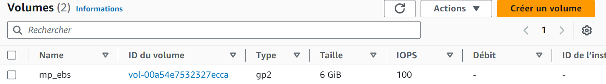
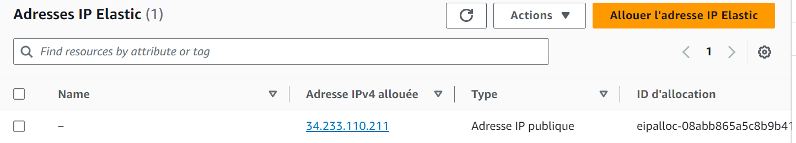
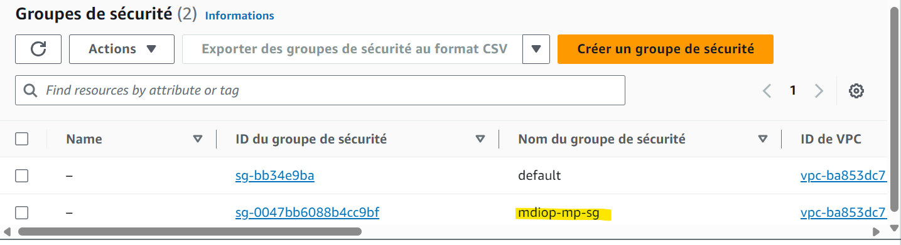
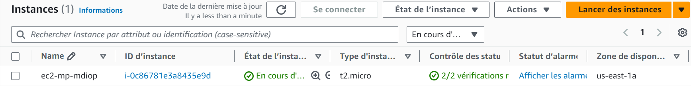
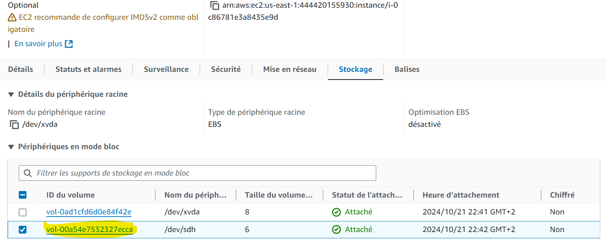
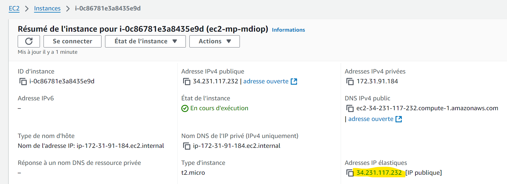
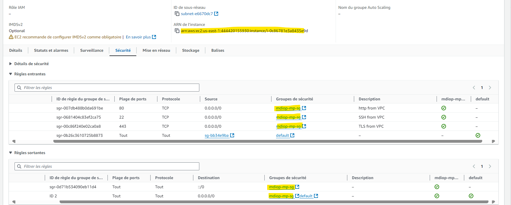
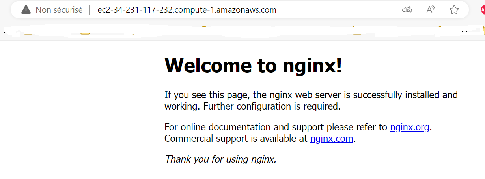
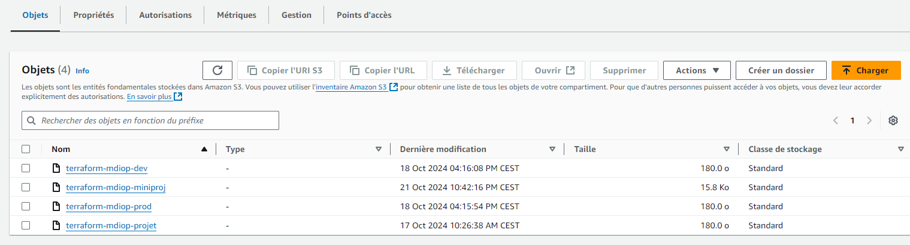

.
├── README.md

├── app

│   └── main.tf

├── creds

│   └── credentials

└── modules

    ├── ebs_m

    │   ├── main.tf

    │   ├── outputs.tf

    │   └── variable.tf

    ├── ec2_m

    │   ├── devops-mdiop.pem

    │   ├── main.tf # 

    aws ec2 describe-images  --region us-east-1 --owners amazon --filters Name=name,Values=*ubuntu-bionic* Name=architecture,Values=x86_64

    │   ├── outputs.tf

    │   └── variable.tf

    ├── ippub_m

    │   ├── main.tf

    │   └── outputs.tf

    └── secu_m
        ├── main.tf

        ├── outputs.tf

        └── variable.tf

7 directories, 15 files

####################To Execute ###############
Go to 
# cd app
# terraform init
# terraform plan
# terraform apply
##################EC2 image #########################
------------------------Volume-----------------------------

------------------------Elastic IP-------------------------

------------------------Security Group----------------------

------------------------EC2--------------------------------

------------------------aws_volume_attachment------------------------

------------------------aws_eip_association------------------------

----------------aws_network_interface_sg_attachment------------------

----------------NGINX Install------------------

----------------S3 TFSATE------------------
S3 Tfstate 

##################Destroy#########################

# terraform destroy